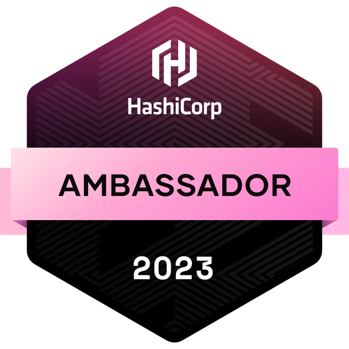
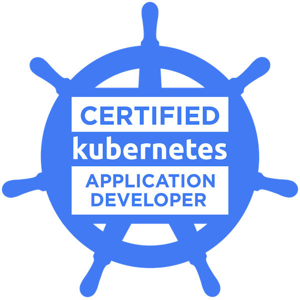

## Hola, soy Antonio (nito) Moreno 👋👨🏻‍💻

I'm Antonio (Nito) Moreno. I'm a full-time software engineer. And I love learning new stuff related to engineering. My main motivation is
to do products and companies that are heavily used and which use-cases matter. Attracted by
difficult performance problems. 💬 Truly believer of T-shaping. A software engineer should be able to run an app from the
architecture design, development, deployment, and to the maintenance in production. A software engineer should know what entails for the
business every change that they do.

Since I mainly learn from others, I also want to give back to the community creating some learning content, which you
might find below.

## Where we can meet 📣

- 
- 
- 

## Certifications

<table>
<thead>
  <tr>
    <th> HashiCorp Ambassador 2023 </th>
    <th> CKAD: Certified Kubernetes Application Developer </th>
    <th> CKA: Certified Kubernetes Administrator </th>
    <th> AWS Certified Developer – Associate </th>
  </tr>
</thead>
<tbody>
  <tr>
    <td>
        
    </td>
    <td>
         
    </td>
    <td>
        
    </td>
    <td>
        
    </td>
  </tr>
</tbody>
</table>

